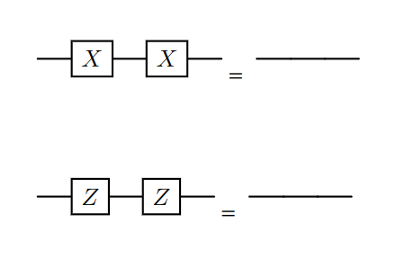
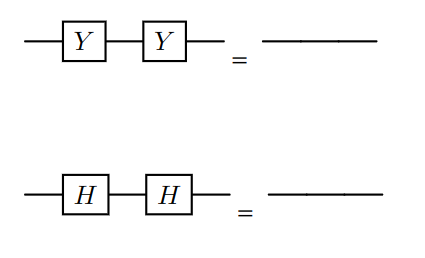
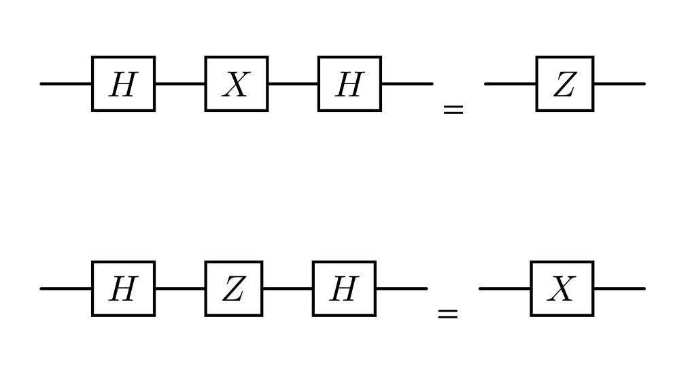
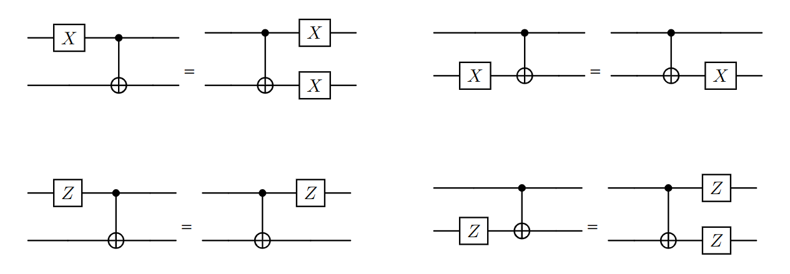

# Table of Contents
- [Introduction](#introduction)
- [Overview of Project](#overview-of-project)
- [Goals](#goals)
- [Installation Guide](#installation-guide)
- [How To Use the Tool](#how-to-use-the-tool)
- [What is MLIR?](#what-is-mlir)
    - [Dialects](#mlir-dialects)
    - [Operations](#operations)
    - [Transformations](#transformations)
    - [Pattern Rewriting](#pattern-rewriting)
    - [Passes](#passes)
- [MLIR in Catalyst](#mlir-in-catalyst)
    - [Quantum Dialect](#quantum-dialect)
    - [Quantum Operations](#quantum-operations)
    - [Quantum Transformations](#quantum-transformations)
    - [Pattern Rewriting in Catalyst](#pattern-rewriting-in-catalyst)
    - [Passes in Catalyst](#passes-in-catalyst)
- [Implementing Quantum Circuit Identities](#implementing-quantum-circuit-identities)
    - [CNOT Cancellation](#cnot-cancellation)
    - [Hermitian Cancellation](#hermitian-cancellation)
    - [Hadamard Conjugation](#hadamard-conjugation)
    - [CNOT Propagation](#cnot-propagation)
    - [Detailed Walkthrough of Implementing the `HadamardConjugationPass`](#detailed-walkthrough-of-implementing-the-hadamardconjugationpass)
    - [Running the Passes](#running-the-passes)
    - [Executing the Passes](#executing-the-passes)
    - [Combining Multiple Passes](#combining-multiple-passes)
- [Results](#results)
- [Conclusion](#conclusion)
    - [Future Work](#future-work)

# Introduction
As a comprehensive resource, this document serves both as a project work log and a guide to implementing custom program transformation rules. It includes necessary background information on MLIR and its role in Catalyst, much of which is not readily available in the official documentation. This document provides a detailed explanation of implementing custom passes, expanding upon the predefined test cases demonstrated above. A solid understanding of MLIR concepts and their application in Catalyst is required to fully grasp the implementation details. 

# Overview of Project
Catalyst is a quantum programming framework that enables just-in-time (JIT) compilation of quantum programs written in PennyLane. It consists of a core compiler built using MLIR and a C++-based runtime quantum simulator.

The focus of this project is to implement custom program transformation rules in Catalyst’s intermediate representation (IR), which is built on MLIR, to perform quantum circuit optimization. The goal is to apply well-established optimization rules to simplify quantum circuits and enhance their performance.

# Goals

The project focused on two main objectives: understanding code optimizations and their practical application in frameworks like MLIR, and implementing custom transformations. Specifically, the goals were:

- **Explore Compiler Optimizations in Quantum Software**: Investigate how compiler optimizations, particularly peephole optimizations, can improve quantum circuit development.
- **Gain Expertise in MLIR**: Understand the MLIR framework and its role in developing efficient quantum compilers.
- **Understand State-of-the-Art Quantum Libraries**: Study Catalyst in the context of leading quantum libraries like Pennylane to gain insights into modern quantum computing frameworks.

# Installation Guide
This guide provides step-by-step instructions to install and build the project on a local machine running Ubuntu 22.04 LTS. While official installation instructions via Docker are available, the provided scripts are outdated and do not work even after modifications. For simplicity, we use a forked repository with up-to-date changes to ensure compatibility with the latest updates from the main repository.

### Clone the Repository
First, clone the forked repository:
```bash
git clone https://github.com/patelvyom/catalyst.git
```

### Build Requirements
This project requires building from source to enable custom passes. Minor modifications to the original CMake file have been made to align with local library installations.

#### Prerequisites
Install the necessary system packages:
```bash
sudo apt install clang lld ccache libomp-dev ninja-build make cmake libstdc++-12-dev python3-dev
```

We recommend using `conda` for Python environment management, though it is not strictly required by the official documentation. Follow the instructions [here](https://docs.anaconda.com/miniconda/install/) to install Miniconda.

Once Miniconda is installed, create and activate a new environment:
```bash
conda create -n catalyst python=3.11
conda activate catalyst
```

#### Install Python Dependencies
Navigate to the cloned repository and install the required Python packages:
```bash
cd catalyst
pip install -r requirements.txt
```

### Build the Project
Ensure the `conda` environment is active before proceeding. Build the project by running:
```bash
make all
```
> **Note:** Building the project involves compiling LLVM and MLIR from source, which may take several hours depending on your system configuration.

### Test the Installation
After a successful build, you can verify the installation by running the test suite:
```bash
make test
```

### Additional Resources
The steps outlined above should suffice to build and test the project. For more detailed information, refer to the [official documentation](https://docs.pennylane.ai/projects/catalyst/en/stable/dev/installation.html).


### Minimal Working Example
We will now create a minimal working example to demonstrate the custom pass implementation. Run the following command:
```
./mlir/build/bin/catalyst-cli examples/c1.mlir --tool=opt --catalyst-pipeline="pipe(hadamard-conjugation)" --mlir-print-ir-after-all --mlir-print-stacktrace-on-diagnostic
```
This command will run the `hadamard-conjugation` pass on the circuit defined in `examples/c1.mlir`. The output will be printed to the console.

# How to Use the Tool

To illustrate its usage, the file `examples/c1.mlir` contains a minimal working example of a simple 1-qubit quantum circuit. The tool offers the following options for processing and optimizing such circuits:

- **`--tool=opt`**: Performs MLIR-level optimizations, including quantum-specific optimizations, and translates the input dialect to the LLVM dialect.
- **`--catalyst-pipeline`**: Specifies a transformation pipeline to apply to the input circuit. For example, the `hadamard-conjugation` pipeline simplifies the circuit by applying the identity \(HXH \rightarrow Z\).
- **`--mlir-print-ir-after-all`**: Prints the Intermediate Representation (IR) after each transformation pass.
- **`--mlir-print-stacktrace-on-diagnostic`**: Outputs a stack trace in case of any diagnostic messages.

To use the tool, select an example from the `examples` directory and choose any pass defined in Catalyst. For instance, running the following command applies a series of transformations (`hadamard-conjugation`, `cnot-cancellation`, and `hermitian-cancellation`) to the circuit and writes the transformed operations to an output file:  
```bash
./mlir/build/bin/catalyst-cli examples/c1.mlir -o c1_transformed.mlir --tool=opt --catalyst-pipeline="pipe(hadamard-conjugation, cnot-cancellation, hermitian-cancellation)" --mlir-print-ir-after-all --mlir-print-stacktrace-on-diagnostic
```
# What is MLIR?
MLIR is built around a graph-like data structure consisting of **Operations** (nodes) and **Values** (edges). Each Value represents the result of a single Operation or Block Argument and is associated with a **Value Type**, defined by the type system. Operations are grouped within **Blocks**, which are themselves organized into **Regions**.

## Dialects
MLIR dialects encapsulate operations, types, attributes, traits, and interface. Each dialect represents a specific abstraction level which enables reusable IR (Intermediate Representation) objects.

Dialects are designed to be composable rather than monolithic, making them suitable for quantum programs. They facilitate program lowering from high-level representations to low-level instructions. This process involves converting complex operations into simpler ones and allocating memory for high-level constructs.

Additionally, MLIR's framework supports interaction of multiple dialects within a single module, even if they originate outside the main MLIR tree. Dialects are produced and consumed by compiler passes, with built-in mechanisms to enable conversion between different dialects. 

MLIR dialects are primarily defined using a combination of declarative and imperative approaches. The declarative aspect relies on the Operation Definition Specification (ODS), a simple domain-specific language used within TableGen (`.td` files) to specify new IR objects. These definitions are processed by the build system to automatically generate C++ header and implementation files. Meanwhile, the imperative aspect involves adding custom logic and implementing transformations directly in C++ source files, allowing for more complex functionality and fine-grained control over the dialect's behavior.

Source: [Catalyst Documentation](https://docs.pennylane.ai/projects/catalyst/en/stable/dev/dialects.html)

## Operations
MLIR uses a unified concept of operations to represent a wide range of abstractions and computations. An operation in MLIR is represented in a straightforward manner. Each operation is identified by a unique string, can produce zero or more results, and accept zero or more operands. It also includes storage for properties, a dictionary of attributes, successors, and regions.

For example, the following code defines an operation called `tf.scramble`, which takes two inputs and includes an attribute `"fruit"` set to `"banana"`:
```c++
%2 = "tf.scramble"(%result#0, %bar) <{fruit = "banana"}> : (f32, i32) -> f32
```

## Transformations
Program transformation in MLIR revolves around modifying the IR, typically in the form of operations. This can be accomplished using several techniques, including pattern matching and rewriting, folding, and canonicalization. In this context, we will focus on pattern rewriting.

## Pattern Rewriting
Pattern rewriting involves identifying specific configurations of operations arranged as a directed acyclic graph (DAG). By leveraging this approach, transformations can be implemented in a generic and flexible manner such that we only need to specify the source pattern to match and the corresponding replacement pattern. Patterns are defined by inheriting from the `RewritePattern` class.

### Match and Rewrite
Match and Rewrite involves matching a given root `Operation` followed by a rewrite of the IR. A `RewritePattern` can specify this implementation either via separate `match` and `rewrite` methods, or via a combined `matchAndRewrite` method. The return value of `matchAndRewrite` is a `LogicalResult`, which is a wrapper around a boolean to signal success or failure.

## Passes
Just defining rewriting rule is not enough to begin transforming IR. We need to define some way of traversing through the IR and applying these rules. This is where passes come in. A pass is a transformation that is applied to a module or function. It is a unit of transformation in MLIR.

# MLIR in Catalyst
Now that we have a basic understanding of MLIR, let us look at MLIR in the context of Catalyst.

## Quantum Dialect
The Quantum Dialect in Catalyst extends the MLIR framework with specialised types and operations the forms the foundation of Catalyst's IR. This dialect is designed with value semantics, where quantum operations consume and produce abstract qubit values which exposes the dataflow of quantum programs within MLIR's SSA graph. This approach contrasts with traditional methods that manipulate qubit references directly.

Key types defined in the Quantum Dialect include:
- **QubitType:** Represents a single qubit as a value.
- **QuregType:** Represents a quantum register, an array of qubits.
- **ObservableType:** Represents a quantum observable used in measurements.
- **ResultType:** Represents the result of a quantum measurement.

For further details, refer to `catalyst/mlir/include/Quantum/IR/QuantumDialect.td`.

## Quantum Operations
In Catalyst, quantum operations are defined in MLIR to manipulate quantum states and gates. One such operation is the `CustomOp`, which extends the `UnitaryGate_Op`. This operation represents a generic quantum gate that acts on \(n\) qubits and can take \(m\) floating-point parameters, providing flexibility for defining custom gates in quantum circuits.

Key aspects (relevant to our usecase) of the `CustomOp` operation include:
- **Arguments:** It accepts variadic floating-point parameters (`$params`), quantum qubits (`$in_qubits`), a gate name (`$gate_name`), control qubits (`$in_ctrl_qubits`), and control values (`$in_ctrl_values`).
- **Results:** The operation produces variadic quantum qubits (`$out_qubits`) and control qubits (`$out_ctrl_qubits`).
- **Methods:** The operation provides various methods for managing qubit operands and control qubits, including `getQubitOperands()` and `setQubitOperands()`.

For example, the `CustomOp` can represent a CNOT gate as follows:
```c++
%out_qubits:2 = quantum.custom "CNOT"() %1, %2 : !quantum.bit, !quantum.bit
```
In this case, the `quantum.custom` operation represents a custom quantum gate named "CNOT" that operates on two input qubits `%1` and `%2`, producing two output qubits.

## Quantum Transformations
These form the core of our project. Quantum transformations in Catalyst are implemented as custom passes that apply specific rules to transform quantum circuits. These rules are defined as pattern rewrites, where a source pattern is matched in the IR and replaced with a target pattern. This process is facilitated by MLIR's pattern rewriter infrastructure, which provides a systematic way to traverse the IR and apply transformations. The predefined patterns are:

- `QuantumBufferization`
- `QuantumConversion`
- `EmitCatalystPyInterface`
- `CopyGlobalMemRef`
- `AdjointLowering`
- `RemoveChainedSelfInverse`
- `AnnotateFunction`
- `SplitMultipleTapes`
- `MergeRotations`
- `IonsDecomposition`


## Pattern Rewriting in Catalyst
In Catalyst, all IR mutations, including creation and modification of operations, are performed using the `PatternRewriter` class. Key methods include:

- `eraseOp`: Erase an Operation.
- `notifyMatchFailure`: Notify Match Failure.
- `replaceOp | replaceOpWithNewOp`: Replace an Operation.
- `(start|cancel|finalize)OpModification`: Update an Operation In-place.

## Passes in Catalyst
In Catalyst, we focus on using `applyPatternsAndFoldGreedily` for our custom passes. The function `applyPatternsAndFoldGreedily(targetfunc, std::move(patterns))` applies a rewriter to each operation in the `targetFunc`. It iteratively rewrites all operations nested under the given operation by greedily applying the most beneficial patterns until a fixpoint is reached. In addition, it performs folding and simple dead-code elimination before attempting to match any provided patterns. For example, this allows us to replace the second CNOT operation with the inputs from the first CNOT operation, while automatically eliminating the redundant operations.

# Implementing Quantum Circuit Identities
In this section, we explore how specific quantum circuit identities are implemented using matching and rewriting rules.

## CNOT Cancellation

{ width=50% }

The **CNOT Cancellation** identity simplifies a quantum circuit by removing two consecutive CNOT gates acting on the same qubits. For example, consider the following operations:

```mlir
%3:2 = quantum.custom "CNOT"() %1, %2 : !quantum.bit, !quantum.bit
%4:2 = quantum.custom "CNOT"() %3#0, %3#1 : !quantum.bit, !quantum.bit
return %4#0, %4#1 : !quantum.bit, !quantum.bit
```

This sequence can be simplified to:

```mlir
return %1, %2 : !quantum.bit, !quantum.bit
```
The `match` and `rewrite` functions for this identity are as follows:
### Match:
```c++
StringRef opGateName = op.getGateName();
if (opGateName != "CNOT")
    return failure();

VerifyParentGateAndNameAnalysis vpga(op);
if (!vpga.getVerifierResult())
    return failure();

auto parentOp = cast<CustomOp>(op.getInQubits()[0].getDefiningOp());
StringRef parentGateName = parentOp.getGateName();
if (parentGateName != "CNOT")
    return failure();
return success();
```
Here, we verify whether the current operation is a CNOT gate and if its preceding operation in the DAG, referred to as the "parent" operation, is also a CNOT gate.

### Rewrite  
The **rewrite** step replaces the current CNOT operation with the input qubits from its parent operation, effectively eliminating redundancy. The implementation is as follows:
```c++
std::vector<mlir::Value> originalQubits = parentOp.getQubitOperands();
rewriter.replaceOp(op, originalQubits);
```
This ensures that the current operation is replaced by the input qubits of the parent, simplifying the circuit.

## Hermitian Cancellation
{ width=49% } { width=49% }
The Hermitian Cancellation pass is similar to the CNOT Cancellation pass. It simplifies a quantum circuit by removing two consecutive single-qubit Hermitian gates acting on the same qubit. For example, consider the following operations:
```mlir
%2 = quantum.custom "PauliX"() %1 : !quantum.bit
%3 = quantum.custom "PauliX"() %2 : !quantum.bit
return %3 : !quantum.bit
```
This sequence can be simplified to:
```mlir
return %1 : !quantum.bit
```
The `match` and `rewrite` functions for this identity are similar to those in the CNOT Cancellation pass, with the key difference being the gate type being matched and replaced. Therefore, we will omit the detailed implementation for brevity.

## Hadamard Conjugation
{ width=50% }
This identity transforms the following operations:
```
%2 = quantum.custom "Hadamard"() %1 : !quantum.bit
%3 = quantum.custom "PauliX"() %2 : !quantum.bit
%4 = quantum.custom "Hadamard"() %3 : !quantum.bit
```
to 
```
%2 = quantum.custom "PauliZ"() %1 : !quantum.bit
```
### matchAndRewrite: 
```c++
StringRef opGateName = op.getGateName();
if (opGateName != "Hadamard")
    return failure();

auto parentOp = dyn_cast_or_null<CustomOp>(op.getInQubits()[0].getDefiningOp());
VerifyParentGateAnalysis<CustomOp> vpga(parentOp);
if (!vpga.getVerifierResult())
    return failure();
StringRef parentGateName = parentOp.getGateName();
if (parentGateName != "PauliX" && parentGateName != "PauliZ")
    return failure();

auto grandParentOp = dyn_cast_or_null<CustomOp>(parentOp.getInQubits()[0].getDefiningOp());
VerifyParentGateAnalysis<CustomOp> vgpga(grandParentOp);
if (!vgpga.getVerifierResult())
    return failure();
StringRef grandParentGateName = grandParentOp.getGateName();
if (grandParentGateName != "Hadamard")
    return failure();

auto loc = op.getLoc();
auto newOpParams = parentOp.getParams();
StringRef newOpName = (parentGateName == "PauliX") ? "PauliZ" : "PauliX";
TypeRange newOpQubitsTypes = op.getOutQubits().getTypes();
ValueRange newOpInQubits = grandParentOp.getInQubits();
auto mergeOp = rewriter.create<CustomOp>(loc, newOpQubitsTypes, ValueRange{}, newOpParams,
                                        newOpInQubits, newOpName, nullptr, ValueRange{}, ValueRange{});
op.replaceAllUsesWith(mergeOp);
return success();
```
The conditions for applying this transformation are as follows:

- The current operation must be a **Hadamard** gate.
- Its parent operation must be either a **PauliX** or **PauliZ** gate.
- The grandparent operation (preceding the parent) must also be a **Hadamard** gate.
- Both the parent and grandparent operations must act on the same qubit.

When these conditions are met, the new operation will use the input qubits of the grandparent operation as its inputs and the current operation’s output qubits as its outputs.

> **Note:** Explicit deletion of the parent and grandparent operations is unnecessary, as the `greedilyApplyPatternsAndFold` function handles dead code elimination automatically.

## CNOT Propagation

The **CNOTPropagationPass** optimizes quantum circuits by propagating **PauliX** or **PauliZ** gates through a **CNOT** gate. This pattern is commonly encountered in quantum circuits, such as when a bit-flip error occurs just before a CNOT gate, causing the error to propagate from the control qubit to the target qubit. 

The transformation involves four similar cases, as illustrated in the accompanying image. Here, we focus on the first case, where a **PauliX** gate acts on the control qubit, and a **CNOT** gate acts on both the control and target qubits. This pattern transforms the following sequence of operations: 
```
%3 = quantum.custom "PauliX"() %1 : !quantum.bit
%out_qubits:2 = quantum.custom "CNOT"() %3, %2 : !quantum.bit, !quantum.bit
return %out_qubits#0, %out_qubits#1 : !quantum.bit, !quantum.bit
```
to
```
%out_qubits:2 = quantum.custom "CNOT"() %1, %2 : !quantum.bit, !quantum.bit
%3 = quantum.custom "PauliX"() %out_qubits#0 : !quantum.bit
%4 = quantum.custom "PauliX"() %out_qubits#1 : !quantum.bit
return %3, %4 : !quantum.bit, !quantum.bit
```
### matchAndRewrite:
```c++
StringRef opGateName = op.getGateName();
if (opGateName != "CNOT"){
    return failure();
}

auto parentOp = dyn_cast_or_null<CustomOp>(op.getInQubits().front().getDefiningOp());
StringRef parentOpGateName = parentOp.getGateName();
if (!PropagationOps.contains(parentOpGateName) || op.getInQubits().size() != 2 || parentOp.getOutQubits().size() != 1)
    return failure();

mlir::Value inCtrlQubit = op.getInQubits().front();
mlir::Value inTargQubit = op.getInQubits().back();
mlir::Value parentOutQubit = parentOp.getOutQubits().front();

bool foundCtrlMatch = (inCtrlQubit == parentOutQubit) ? true : false;
bool foundNonCtrlMatch = (inTargQubit == parentOutQubit) ? true : false;

if (!foundNonCtrlMatch && !foundCtrlMatch)
    return failure();

auto cnotOp = op;
auto xOp = dyn_cast_or_null<quantum::CustomOp>(op.getInQubits().front().getDefiningOp());
TypeRange outQubitsTypes = cnotOp.getOutQubits().getTypes();
mlir::Location opLoc = op.getLoc();

SmallVector<mlir::Value> cnotInQubits;
cnotInQubits.push_back(xOp.getInQubits().front());
cnotInQubits.push_back(cnotOp.getInQubits().back());

auto newCnotOp = rewriter.create<quantum::CustomOp>(
                    opLoc,
                    outQubitsTypes,
                    ValueRange{},
                    cnotOp.getParams(),
                    ValueRange(cnotInQubits),
                    "CNOT",
                    nullptr,
                    ValueRange{},
                    ValueRange{});
auto xOp1 = rewriter.create<quantum::CustomOp>(
            opLoc,
            newCnotOp.getOutQubits().front().getType(),
            ValueRange{},
            xOp.getParams(),
            newCnotOp.getOutQubits().front(),
            "PauliX",
            nullptr,
            ValueRange{},
            ValueRange{});
auto xOp2 = rewriter.create<quantum::CustomOp>(
            opLoc,
            newCnotOp.getOutQubits().back().getType(),
            ValueRange{},
            xOp.getParams(),
            newCnotOp.getOutQubits().back(),
            "PauliX",
            nullptr,
            ValueRange{},
            ValueRange{});

SmallVector<mlir::Value> newOp;
newOp.push_back(newCnotOp.getOutQubits().front());
newOp.push_back(xOp1.getOutQubits().front());
newOp.push_back(xOp2.getOutQubits().front());
op.replaceAllUsesWith(newOp);
rewriter.eraseOp(xOp);
return success();
```
The **matchAndRewrite** logic for this pass begins by identifying a pattern where the current operation is a **CNOT** gate, and its parent operation is a **PauliX** gate. It further verifies that the output qubit of the parent operation matches the control qubit input of the **CNOT** gate.

The rewrite step involves constructing new **CNOT** and **PauliX** gates with updated input and output qubits to reflect the propagated state. The original operations are then replaced with the newly constructed gates.

> **Note:** While the provided rewrite logic is close to the intended functionality, it is not yet fully operational and requires further debugging. Discussions with the Catalyst team suggest the current implementation is nearing its final form.

## Detailed Walkthrough of Implementing the `HadamardConjugationPass`

This section provides a step-by-step guide to adding the `HadamardConjugationPass` to Catalyst from scratch.

### 1. Registering the New Pass
Start by defining the `HadamardConjugationPass` in the `mlir/include/Quantum/Transforms/Passes.td` file:

```c++
def HadamardConjugationPass : Pass<"hadamard-conjugation"> {
    let summary = "Perform Hadamard conjugation on the given quantum circuit.";
    let constructor = "catalyst::createHadamardConjugationPass()";
}
```

This declaration registers `hadamard-conjugation` as a new pass. MLIR will automatically generate the corresponding boilerplate code, which can be found in the `mlir/build/include/Quantum/Transforms/Passes.h.inc` file.

---

### 2. Defining the Pass
Create a new file, `cnot_propagation.cpp`, in the `mlir/lib/Quantum/Transforms` directory. Define the pass's core logic, including its match and rewrite rules:

```c++
#define DEBUG_TYPE "hadamard-conjugation"

#include "Catalyst/IR/CatalystDialect.h"
#include "Quantum/IR/QuantumOps.h"
#include "Quantum/Transforms/Patterns.h"
#include "mlir/Dialect/Func/IR/FuncOps.h"
#include "mlir/Pass/Pass.h"
#include "mlir/Transforms/GreedyPatternRewriteDriver.h"
#include "llvm/Support/Debug.h"

using namespace llvm;
using namespace mlir;
using namespace catalyst::quantum;

namespace catalyst {
namespace quantum {

#define GEN_PASS_DEF_HADAMARDCONJUGATIONPASS
#define GEN_PASS_DECL_HADAMARDCONJUGATIONPASS
#include "Quantum/Transforms/Passes.h.inc"

struct HadamardConjugationPass : impl::HadamardConjugationPassBase<HadamardConjugationPass> {
    using HadamardConjugationPassBase::HadamardConjugationPassBase;

    void runOnOperation() final
    {
        LLVM_DEBUG(dbgs() << "hadamard conjugation pass" << "\n");

        Operation *module = getOperation();

        RewritePatternSet patterns(&getContext());
        populateHadamardConjugationPatterns(patterns);

        if (failed(applyPatternsAndFoldGreedily(module, std::move(patterns)))) {
            return signalPassFailure();
        }
    }
};

} // namespace quantum

std::unique_ptr<Pass> createHadamardConjugationPass()
{
    return std::make_unique<quantum::HadamardConjugationPass>();
}

} // namespace catalyst
```

Then, update the `mlir/lib/Quantum/Transforms/passes.h` file to declare the pass:

```c++
std::unique_ptr<mlir::Pass> createHadamardConjugationPass();
```

---

### 3. Registering the Pass
Register the newly created pass with the Catalyst CLI by modifying the `mlir/lib/Catalyst/RegisterAllPasses.cpp` file:

```c++
mlir::registerPass(catalyst::createHadamardConjugationPass);
```

This ensures the pass can be invoked from the Catalyst command-line interface.

---

### 4. Defining Patterns
Create a new file, `HadamardConjugationPatterns.cpp`, in the `mlir/lib/Quantum/Transforms` directory. Implement the match and rewrite logic for the patterns that the pass will handle:

```c++
#define DEBUG_TYPE "hadamard-conjugation"

#include "Quantum/IR/QuantumOps.h"
#include "Quantum/Transforms/Patterns.h"
#include "VerifyParentGateAnalysis.hpp"
#include "mlir/Dialect/Arith/IR/Arith.h"
#include "llvm/ADT/StringSet.h"
#include "llvm/Support/Debug.h"
#include "llvm/Support/Errc.h"

using llvm::dbgs;
using namespace mlir;
using namespace catalyst::quantum;

namespace {
struct HadamardConjugationRewritePattern : public mlir::OpRewritePattern<CustomOp> {
    using mlir::OpRewritePattern<CustomOp>::OpRewritePattern;

    mlir::LogicalResult matchAndRewrite(CustomOp op, mlir::PatternRewriter &rewriter) const override
    {
        LLVM_DEBUG(dbgs() << "Rewriting the following operation:\n" << op << "\n");
        StringRef opGateName = op.getGateName();
        if (opGateName != "Hadamard")
            return failure();
        auto parentOp = dyn_cast_or_null<CustomOp>(op.getInQubits()[0].getDefiningOp());
        VerifyParentGateAnalysis<CustomOp> vpga(parentOp);
        if (!vpga.getVerifierResult())
            return failure();
        StringRef parentGateName = parentOp.getGateName();
        if (parentGateName != "PauliX" && parentGateName != "PauliZ")
            return failure();

        auto grandParentOp = dyn_cast_or_null<CustomOp>(parentOp.getInQubits()[0].getDefiningOp());
        VerifyParentGateAnalysis<CustomOp> vgpga(grandParentOp);
        if (!vgpga.getVerifierResult())
            return failure();
        StringRef grandParentGateName = grandParentOp.getGateName();
        if (grandParentGateName != "Hadamard")
            return failure();

        auto loc = op.getLoc();
        auto newOpParams = parentOp.getParams();
        StringRef newOpName = (parentGateName == "PauliX") ? "PauliZ" : "PauliX";
        TypeRange newOpQubitsTypes = op.getOutQubits().getTypes();
        ValueRange newOpInQubits = grandParentOp.getInQubits();

        auto mergeOp = rewriter.create<CustomOp>(loc, newOpQubitsTypes, ValueRange{}, newOpParams,
                                                 newOpInQubits, newOpName, nullptr, ValueRange{},
                                                 ValueRange{});
        op.replaceAllUsesWith(mergeOp);
        return success();
    }
};

} // namespace

namespace catalyst {
namespace quantum {

void populateHadamardConjugationPatterns(RewritePatternSet &patterns){
    patterns.add<HadamardConjugationRewritePattern>(patterns.getContext(), 1);
}
} // namespace quantum
} // namespace catalyst
```

---

### 5. Adding Patterns to the Pattern List
Update the `mlir/lib/Quantum/Transforms/Patterns.h` file to include the new patterns:

```c++
void populateHadamardConjugationPatterns(mlir::RewritePatternSet &);
```

---

### 6. Updating the Build System
Add the `HadamardConjugationPatterns.cpp` file to the build system by including it in the `mlir/lib/Quantum/Transforms/CMakeLists.txt` file. This ensures the new file is compiled with the rest of the project.

---

## Running the Passes

Once the custom passes have been implemented, they can be compiled using the following command in the project directory:

```bash
make dialects
```

> **Note**: Ensure that the project has been successfully built beforehand using `make all`.

## Executing the Passes
To run the passes, the `catalyst-cli` tool is used. For example, to execute the `hadamard-conjugation` pass on a quantum circuit defined in `examples/c1.mlir`, use the following command:
```bash
./mlir/build/bin/catalyst-cli examples/c1.mlir --tool=opt --catalyst-pipeline="pipe(hadamard-conjugation)" --mlir-print-ir-after-all --mlir-print-stacktrace-on-diagnostic
```
This will apply the `hadamard-conjugation` pass to the input circuit and print the resulting intermediate representation (IR) to the console.

### Combining Multiple Passes
Passes can also be combined into a pipeline to perform a sequence of transformations on the circuit. For instance, to apply `hadamard-conjugation`, `cnot-cancellation`, and `hermitian-cancellation` passes in succession, use the following command:

```bash
./mlir/build/bin/catalyst-cli examples/c1.mlir --tool=opt --catalyst-pipeline="pipe(hadamard-conjugation, cnot-cancellation, hermitian-cancellation)" --mlir-print-ir-after-all --mlir-print-stacktrace-on-diagnostic
```

This approach enables flexible and efficient transformations by chaining multiple passes together.

## Results
The `examples` directory contains several quantum circuits designed to test the implemented passes. These include tests for individual passes of increasing complexity, as well as tests that combine multiple passes to demonstrate their combined effect on quantum circuits. The results show that the implemented passes produce the desired outcomes.

# Conclusion
This project provided a comprehensive overview of implementing custom program transformation rules in Catalyst's intermediate representation (IR) using MLIR. We explored core MLIR concepts, such as dialects, operations, transformations, pattern rewriting, and passes, and applied these to develop custom passes for quantum circuit optimization. Specifically, we implemented four quantum circuit identities: CNOT Cancellation, Hermitian Cancellation, Hadamard Conjugation, and CNOT Propagation. The project also included a step-by-step demonstration of adding the `HadamardConjugationPass` to Catalyst, from pass registration to pattern definition and execution.

## Future Work
- The `CNOTPropagationPass` is not yet fully functional and will require assistance from the Pennylane team.
- Currently, nested passes of different patterns are not supported. For example, we must manually call the pipeline with `pipe(hermitian-cancellation;cnot-cancellation,hermitian-cancellation)`. This can be improved by applying patterns in a non-greedy manner.
- We can expand the set of quantum circuit identities to match and rewrite.
- The work done here serves as a solid foundation for further contributions to the Catalyst project, as evidenced by the open issues on Catalyst's GitHub repo related to MLIR.